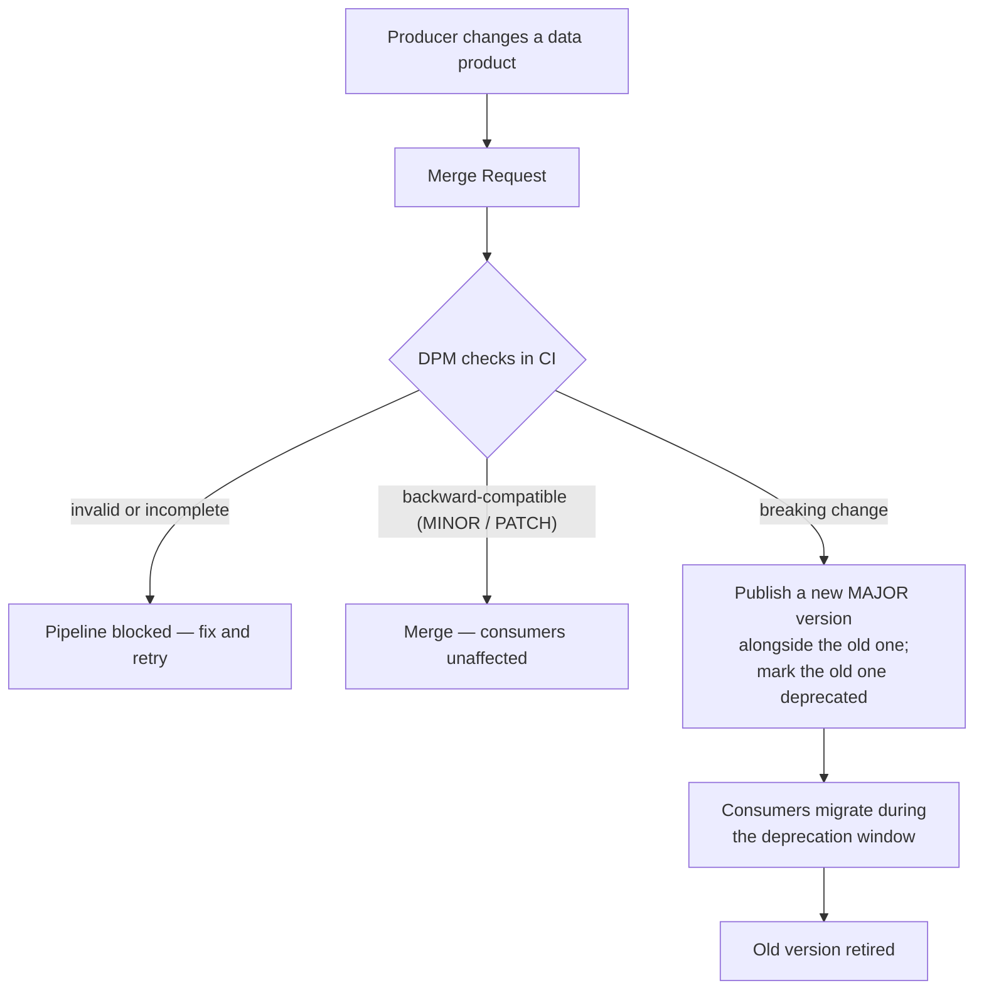

# DPM — Data Product Manifest

[](https://github.com/open-dpm/dpm/actions/workflows/ci.yml)
[](LICENSE)
[](pyproject.toml)
[](https://github.com/open-dpm/dpm/releases)
[](https://t.me/opendpm)

**DPM** is an open-source toolkit that treats **data products as code**: their schema, semantics, quality rules, SLA, ownership and lineage live as versioned files in Git and are validated in CI on every change.

## Why DPM?

A producer renames a column or drops a field. Overnight three dashboards and an ML pipeline break — and nobody was warned. Most data products have no contract, no versioning and no review: their meaning, ownership, SLA and quality live as tribal knowledge.

DPM turns each data product into a **versioned contract** reviewed like code.

## A breaking change — with and without DPM

Say a producer removes the `email` field (or changes `amount` from `int` to `string`):

- **Without DPM** — the merge goes in, the new schema ships, and consumers find out in production when their dashboards and jobs break.
- **With DPM** — the change is a merge request, and DPM catches the breaking schema change in CI, so the pipeline turns red. A breaking change is never merged in place: the producer publishes a new MAJOR version of the manifest **alongside** the current one and marks the old one `deprecated` (its `status` plus the `deprecation` section), giving consumers a migration window before it is retired.

## How it works

Every change to a data product goes through a merge request where DPM, in CI:

- checks the manifest is complete and well-formed (schema, metadata, ownership);
- validates the quality rules and governance requirements;
- detects **breaking schema changes** and enforces the matching SemVer bump.



> Not another generic "data contracts" repo — DPM covers the full **data product** lifecycle, not just schema.

## Security and privacy

Privacy and access are part of the manifest, not an afterthought:

- **Per-field PII flags.** Every schema field can be marked `pii: true`. DPM checks that the product's `metadata.pii` flag stays consistent with the fields marked PII in the schema — a mismatch fails the pipeline — so the privacy picture can't silently drift and is reviewed in the same merge request as the schema.
- **Access posture in the manifest.** The manifest documents how data is produced and accessed — for example, ingestion over **mTLS with certificate CN pinning** at your API gateway, so the right producer writes to the right place. DPM versions and reviews these declarations; enforcing them at runtime is your platform's job.

## Quickstart

```bash
git clone https://github.com/open-dpm/dpm.git
cd dpm
python -m venv .venv && source .venv/bin/activate
pip install -e ".[dev]"

# Validate example manifest
dpm validate examples/aviation/flights/manifest.yaml

# Run tests
pytest
```

## What is in a manifest?

Each data product lives in `examples/{namespace}/{entity}/`:

```text
examples/aviation/flights/
├── manifest.yaml          # Main index: metadata, version, links
├── schema.avsc            # Avro schema
├── semantics.yml          # Business meaning, AI/RAG hints
├── quality_rules.yml      # Executable quality rules
├── sla.yml                # Freshness, availability, retention
├── physical_layout.yml    # Storage layout
├── runbook.md             # Operations guide
└── CODEOWNERS             # Review ownership
```

## CLI

| Command | Description |
|---------|-------------|
| `dpm validate` | Validate manifest structure and references |
| `dpm validate-rules` | Validate quality_rules.yml |
| `dpm governance` | Check governance requirements (owner, SLA, PII) |
| `dpm breaking-changes` | Detect breaking schema changes in git diff |
| `dpm suggest-version` | Suggest semver bump |
| `dpm validate-conformance` | Check products conform to canonical entities (EDM) |
| `dpm conformance-impact` | List products conforming to an `entity@major` |

The rules these commands enforce are documented in [docs/DATA_GOVERNANCE_SPEC.md](docs/DATA_GOVERNANCE_SPEC.md).
Connecting contracts to a canonical / Enterprise Data Model is described in [docs/canonical-model.md](docs/canonical-model.md).

## CI integration

- **GitLab CI** (recommended for corporate/self-hosted): see [docs/ci-gitlab.md](docs/ci-gitlab.md)
- **GitHub Actions** (public repo): see [docs/ci-github.md](docs/ci-github.md)

Copy `ci/gitlab/dpm-manifests.yml` into your manifests repository or include it from this repo.

## Guides

- [docs/gitlab-setup.md](docs/gitlab-setup.md) — mirror DPM into your own GitLab and pull updates
- [docs/steward-guide.md](docs/steward-guide.md) — set up a business-domain manifest repository

## Create a new manifest

```bash
cp -r templates/ examples/my_domain/my_product/
# Edit manifest.yaml from manifest-template.yaml
dpm validate examples/my_domain/my_product/manifest.yaml
```

## DPM vs data contracts (ODCS)

A "data contract" — as captured by the [Open Data Contract Standard (ODCS)](https://github.com/bitol-io/open-data-contract-standard) — is the interface between a data producer and its consumers: schema, SLA and quality expectations. DPM is a **superset** aimed at the full data product: it keeps the contract but adds business semantics (for AI/RAG), physical layout, an operational runbook, lineage, lifecycle/versioning and governance enforced in CI.

| Concept | ODCS | DPM |
|---------|------|-----|
| Schema | `schema` | `schema.avsc` (Avro) |
| Quality expectations | `quality` | `quality_rules.yml` |
| SLA | `slaProperties` | `sla.yml` |
| Ownership | `team` / roles | `metadata.owner` + `CODEOWNERS` |
| Versioning | `version` | `manifest_version` (SemVer) + breaking-change detection |
| Business semantics | — | `semantics.yml` |
| Physical layout | — | `physical_layout.yml` |
| Operational runbook | — | `runbook.md` |

## License

DPM is dual-licensed:

- **GNU AGPL-3.0-or-later** for open-source use — see [LICENSE](LICENSE). You may use, modify
  and run it freely, including commercially, as long as you honour the AGPL (publish the source
  of modified versions, including when offered over a network).
- A **commercial license** for organizations that cannot accept the AGPL terms (e.g. embedding
  in a closed product or running a closed managed service) — see [COMMERCIAL-LICENSE.md](COMMERCIAL-LICENSE.md).

Running the `dpm` CLI to validate your own manifests does not make your data a derivative work
and needs no commercial license.

Contributions are accepted under the [Contributor License Agreement](CLA.md).

## Roadmap

See [CHANGELOG.md](CHANGELOG.md). Phase 2: PyPI publish, GitLab CE demo, runtime validator, integrations.
