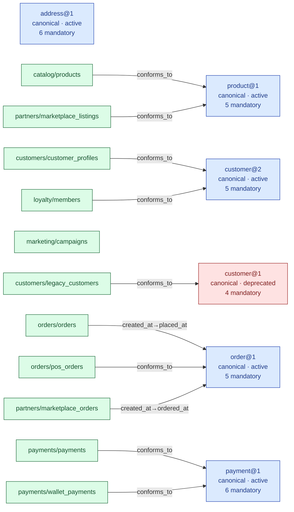

# Visualizing the conformance graph

`dpm graph` renders how data products relate to the canonical Enterprise Data
Model: which product **conforms to** which canonical entity, and under which
field renames. It reads the same manifests git already holds — the picture is a
projection of the source of truth, never a second copy you edit.

> **Scope.** DPM models exactly one cross-artifact relationship: a product
> declares `metadata.conforms_to: [{entity: name@major}]`. There are **no**
> entity-to-entity (ER / foreign-key) relationships in DPM, so none are drawn.
> The graph is bipartite: canonical entities on one side, products on the other.

## Usage

```bash
# Mermaid (default) — paste into any Markdown that renders Mermaid (GitLab, GitHub)
dpm graph --base-path . --registry-path examples/canonical

# JSON — a machine-readable model for a custom viewer
dpm graph --base-path . --registry-path examples/canonical --format json

# Write to a file
dpm graph --base-path . --registry-path examples/canonical --output graph.mmd
```

- `--base-path` — where to scan for product manifests (looks under `examples/`
  if present, otherwise directly under the path). Canonical entity manifests
  found here are **not** drawn as products.
- `--registry-path` — the canonical registry (`<entity>/v<major>/`). Optional:
  without it, entities are inferred from what products reference and every
  entity node is shown as *unresolved*. With it, entity nodes carry their
  status and mandatory-attribute count, and entities with no conformer yet are
  still shown.
- `--format` — `mermaid` (default) or `json`.

## What the nodes mean

- **Entity** (blue) — a canonical entity resolved from the registry, labelled
  `name@major`, its status, and its mandatory-attribute count.
- **Entity, deprecated** (red) — a resolved entity whose `status: deprecated`;
  conformers should migrate before its sunset.
- **Entity, unresolved** (grey, dashed) — referenced by a product's
  `conforms_to` but absent from the registry (typo, or not yet defined).
- **Product** (green) — a data product, labelled `namespace/name`. A product
  with no edge conforms to no entity — a visible "outside the EDM" signal.

Edges are labelled with the attribute rename (`canonical→physical`), or
`conforms_to` when the field names match.

## Example

The bundled examples model a small online store — `customers`, `loyalty`,
`orders`, `catalog`, `payments`, `partners` and `marketing` domains, several of
which publish the *same* canonical entity. Running
`dpm graph --registry-path examples/canonical` produces:



This is where the EDM pays off: **three products converge on `order@1`** —
`orders/orders` (web), `orders/pos_orders` (in-store) and
`partners/marketplace_orders` (marketplace) — three teams, three physical field
names (`placed_at`, `created_at`, `ordered_at`), one shared entity the check
holds them all to. Likewise `customer@2`, `payment@1` and `product@1` each have
two publishers. Meanwhile `customers/legacy_customers` still conforms to the
**deprecated** `customer@1` (a migration warning, not an error); `address@1` is
declared but has **no conformer yet**; and `marketing/campaigns` sits
**outside the EDM** (no `conforms_to`) — both visible gaps.

## JSON shape

```json
{
  "entities": [
    {"name": "...", "major": "1", "status": "active", "resolved": true,
     "mandatory": ["..."], "optional": ["..."]}
  ],
  "products": [
    {"name": "namespace/name", "namespace": "...", "manifest": "path/to/manifest.yaml"}
  ],
  "edges": [
    {"product": "path/to/manifest.yaml", "entity": "name@major", "rename": {"canonical": "physical"}}
  ]
}
```

Output is deterministic (nodes and edges are sorted), so it diffs cleanly and
can be committed or fed to a downstream viewer.
